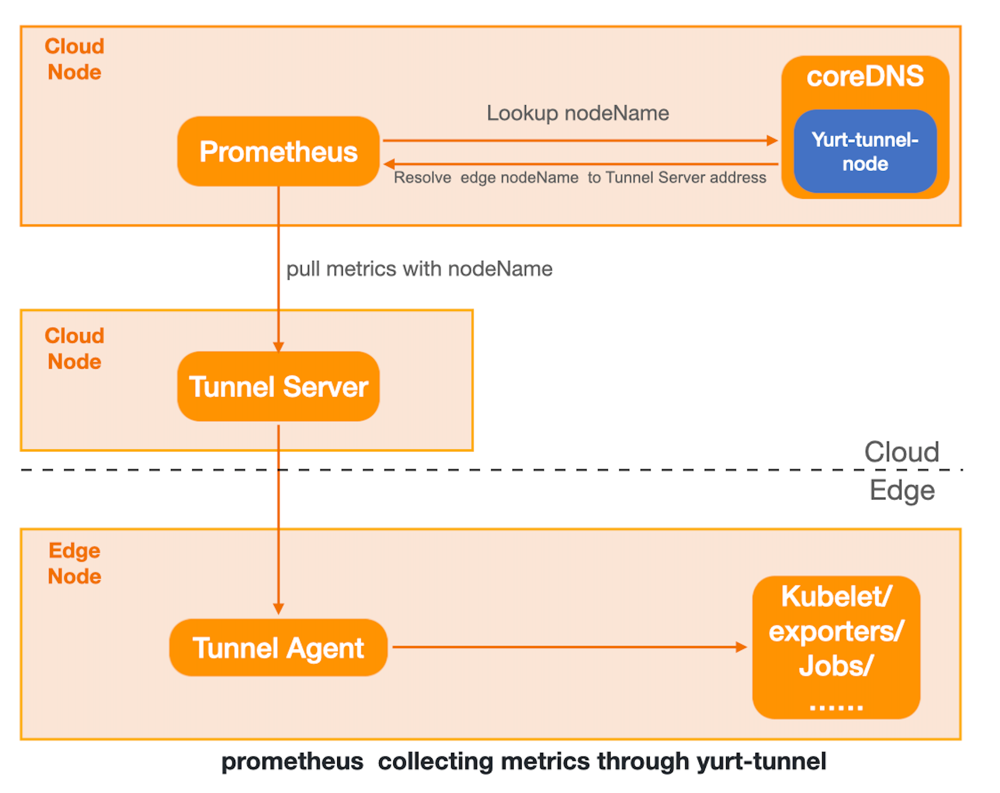

# prometheus

this tutorial shows how to setup  prometheus to collects node metrics on the  edge through yurt-tunnel with DNS mode.Yurt-tunnel maintains a ConfigMap which will resolve edge nodeName to the address of  Yurt-tunnel server,and It will proxy traffic from cloud to edge.

## Local up OpenYurt cluster

if you don't have the OpenYurt cluster, you can run the command [`local_up_openyurt.sh`](../../hack/local_up_openyurt.sh) to quickly set  up the OpenYurt cluster. you can reference this [turorial](./yurt-e2e-test.md) to figure out more details.

in the OpenYurt work path,you can run the command as follows:

```bash
bash hack/local_up_openyurt.sh
```

If everything goes right, we will have a OpenYurt cluster running:

```bash
$ kubectl get node -o wide
NAME                              STATUS   ROLES                  AGE     VERSION
openyurt-e2e-test-control-plane   Ready    control-plane,master   4m15s   v1.20.7
openyurt-e2e-test-worker          Ready    <none>                 3m42s   v1.20.7
```

## Install prometheus

here we use [kube-prometheus-stack](https://github.com/prometheus-community/helm-charts/tree/main/charts/kube-prometheus-stack) to quickly install prometheus.

```bash
helm repo add prometheus-community https://prometheus-community.github.io/helm-charts
helm repo update
helm install prom prometheus-community/kube-prometheus-stack
```

## Modify the coreDNS config

### 1.modify the deployment of coreDNS to mount the ConfigMap `yurt-tunnel-nodes`

```bash
kubectl patch deployment coredns -n kube-system  -p '{"spec": {"template": {"spec": {"volumes": [{"configMap":{"name":"yurt-tunnel-nodes"},"name": "edge"}]}}}}'
kubectl patch deployment coredns -n kube-system   -p '{"spec": { "template": { "spec": { "containers": [{"name":"coredns","volumeMounts": [{"mountPath": "/etc/edge", "name": "edge", "readOnly": true }]}]}}}}'
```

### 2.modify the ConfigMap of coreDNS

Use the [hosts](https://coredns.io/plugins/hosts/) plugin of coreDNS to add the dns records  into coreDNS.

```bash
$ kubectl edit configmap coredns -n kube-system
...........
 Corefile: |
    .:53 {
        errors
        health {
           lameduck 5s
        }
        ready
        hosts /etc/edge/tunnel-nodes {    # add hosts plugin
            reload 300ms
            fallthrough
        }
        kubernetes cluster.local in-addr.arpa ip6.arpa {
           pods insecure
           fallthrough in-addr.arpa ip6.arpa
           ttl 30
        }
        prometheus :9153
        forward . /etc/resolv.conf {
           max_concurrent 1000
        }
        cache 30
        loop
        reload
        loadbalance
    }
```

After this we should restart the coreDNS

```bash
kubectl patch deployment coredns -n kube-system -p '{"spec":{"template":{"spec":{"containers":[{"name":"coredns","env":[{"name":"RESTART","value":"'$(date +%s)'"}]}]}}}}'
```

## Modify the target of prometheus

The prometheus targets  endpoint for kubernetes use host ip as default, we need to replace the host ip with hostname,so that we can fetch the metrics through the yurt-tunnel.

- You can find more about relabel rule in the [prometheus docs](https://prometheus.io/docs/prometheus/latest/configuration/configuration/#relabel_config).

- And for different Kubernetes Labels you can take a look at this  [link](https://prometheus.io/docs/prometheus/latest/configuration/configuration/#kubernetes_sd_config).

### For kubelet

 we need to modify the ServiceMonitor  `prom-kube-prometheus-stack-kubelet`

```bash
kubectl edit  servicemonitor  prom-kube-prometheus-stack-kubelet
```

here we use `__meta_kubernetes_endpoint_address_target_name` label to replace the host ip.

```yaml
spec:
  endpoint:
    ..........
    relabelings:
    - action: replace  # add relabel rule
      regex: (.*);.*:(.*)
      replacement: $1:$2
      sourceLabels:
      - __meta_kubernetes_endpoint_address_target_name
      - __address__
      targetLabel: __address__
    ..........
```

### For others

By default `Yurt-tunnel` only forwards two ports ,10250 and 10255,if we what to support more ports, we need to modfiy the ConfigMap`yurt-tunnel-server-cfg`,here we take`node-exporter` as an example. we need to add https port`9100`,so modify the `https-proxy-ports`.Similarly, if you want to  add http port, modify the `http-proxy-ports`.

```bash
kubectl patch configmap yurt-tunnel-server-cfg  -n kube-system  -p '{"data": {"https-proxy-ports":"9100"}}'
```

Like before, we modify the `ServiceMonitor` of node-exporter.

```bash
kubectl edit servicemonitor  prom-kube-prometheus-stack-node-exporter
```

here we use `__meta_kubernetes_pod_node_name` label to replace the host ip.

```yaml
spec:
 endpoint:
   ......
   relabelings:
    - action: replace #add relabel rule
      regex: (.*);.*:(.*)
      replacement: $1:$2
      sourceLabels:
      - __meta_kubernetes_pod_node_name
      - __address__
      targetLabel: __address__
    ........
```

## Reference

[Openyurt Yurt-Tunnel DNS模式实践](https://juejin.cn/post/7006898548415414279)