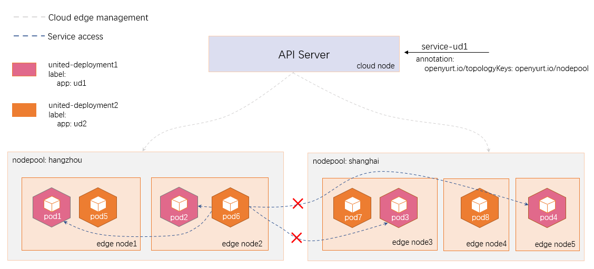

# Service Topology

This document introduces how to use *Service Topology* in OpenYurt cluster.

*Service Topology* enables a service to route traffic based on the Node topology of the cluster. For example, a service can specify that traffic be preferentially routed to endpoints that are on the same Node as the client, or in the same availability NodePool.

The following picture shows the general function of the *service topology*.



To use *service topology*, the `EndpointSliceProxying` [feature gate](https://kubernetes.io/docs/reference/command-line-tools-reference/feature-gates/) must be enabled, and kube-proxy needs to be configured to connect to Yurthub instead of the API Server.

You can set the `topologyKeys` values of a service to direct traffic as follows. If `topologyKeys` is not specified or empty, no topology constraints will be applied.

|    **annotation Key**    |                  **annotation Value**                  |               **explain**               |
| :----------------------: | :----------------------------------------------------: | :-------------------------------------: |
| openyurt.io/topologyKeys |                 kubernetes.io/hostname                 |   Only to endpoints on the same node.   |
| openyurt.io/topologyKeys | kubernetes.io/zone<br /> or <br />openyurt.io/nodepool | Only to endpoints on the same nodepool. |

## Prerequisites

1. Kubernetes v1.18 or above, since EndpointSlice resource needs to be supported.
2. Yurt-app-manager is deployed in the cluster.

## How to use

Ensure that kubernetes version is v1.18+.

```bash
$ kubectl get node
NAME                 STATUS   ROLES    AGE     VERSION
kind-control-plane   Ready    master   6m21s   v1.18.19
kind-worker          Ready    <none>   5m42s   v1.18.19
kind-worker2         Ready    <none>   5m42s   v1.18.19
```

Ensure that yurt-app-manager is deployed in the cluster.

```bash
$ kubectl get pod -n kube-system
NAME                                         READY   STATUS    RESTARTS   AGE
coredns-66bff467f8-jxvnw                     1/1     Running   0          7m28s
coredns-66bff467f8-lk8v5                     1/1     Running   0          7m28s
etcd-kind-control-plane                      1/1     Running   0          7m39s
kindnet-5dpxt                                1/1     Running   0          7m28s
kindnet-ckz88                                1/1     Running   0          7m10s
kindnet-sqxs7                                1/1     Running   0          7m10s
kube-apiserver-kind-control-plane            1/1     Running   0          7m39s
kube-controller-manager-kind-control-plane   1/1     Running   0          5m38s
kube-proxy-ddgjt                             1/1     Running   0          7m28s
kube-proxy-j25kr                             1/1     Running   0          7m10s
kube-proxy-jt9cw                             1/1     Running   0          7m10s
kube-scheduler-kind-control-plane            1/1     Running   0          7m39s
yurt-app-manager-699ffdcb78-8m9sf            1/1     Running   0          37s
yurt-app-manager-699ffdcb78-fdqmq            1/1     Running   0          37s
yurt-controller-manager-6c95788bf-jrqts      1/1     Running   0          6m17s
yurt-hub-kind-control-plane                  1/1     Running   0          3m36s
yurt-hub-kind-worker                         1/1     Running   0          4m50s
yurt-hub-kind-worker2                        1/1     Running   0          4m50s
```

### Configure kube-proxy

To use *service topology*, the `EndpointSliceProxying` [feature gate](https://kubernetes.io/docs/reference/command-line-tools-reference/feature-gates/) must be enabled, and kube-proxy needs to be configured to connect to Yurthub instead of the API Server.

```bash
$ kubectl edit cm -n kube-system kube-proxy
apiVersion: v1
data:
  config.conf: |-
    apiVersion: kubeproxy.config.k8s.io/v1alpha1
    bindAddress: 0.0.0.0
    featureGates: # 1. enable EndpointSliceProxying feature gate.
      EndpointSliceProxying: true
    clientConnection:
      acceptContentTypes: ""
      burst: 0
      contentType: ""
      #kubeconfig: /var/lib/kube-proxy/kubeconfig.conf # 2. comment this line.
      qps: 0
    clusterCIDR: 10.244.0.0/16
    configSyncPeriod: 0s
```

Restart kube-proxy.

```bash
$ kubectl delete pod --selector k8s-app=kube-proxy -n kube-system
pod "kube-proxy-cbsmj" deleted
pod "kube-proxy-cqwcs" deleted
pod "kube-proxy-m9dgk" deleted
```

### Create NodePools

- Create test nodepools.

```bash
$ cat << EOF | kubectl apply -f -
apiVersion: apps.openyurt.io/v1alpha1
kind: NodePool
metadata:
  name: beijing
spec:
  type: Cloud

---

apiVersion: apps.openyurt.io/v1alpha1
kind: NodePool
metadata:
  name: hangzhou
spec:
  type: Edge
  annotations:
    apps.openyurt.io/example: test-hangzhou
  labels:
    apps.openyurt.io/example: test-hangzhou

---

apiVersion: apps.openyurt.io/v1alpha1
kind: NodePool
metadata:
  name: shanghai
spec:
  type: Edge
  annotations:
    apps.openyurt.io/example: test-shanghai
  labels:
    apps.openyurt.io/example: test-shanghai
EOF
```

- Add nodes to the nodepool.

```bash
$ kubectl label node kind-control-plane apps.openyurt.io/desired-nodepool=beijing
node/kind-control-plane labeled

$ kubectl label node kind-worker apps.openyurt.io/desired-nodepool=hangzhou
node/kind-worker labeled

$ kubectl label node kind-worker2 apps.openyurt.io/desired-nodepool=shanghai
node/kind-worker2 labeled
```

- Get NodePool.

```bash
$ kubectl get np
NAME       TYPE    READYNODES   NOTREADYNODES   AGE
beijing    Cloud   1            0               63s
hangzhou   Edge    1            0               63s
shanghai   Edge    1            0               63s
```

### Create UnitedDeployment

- Create test united-deployment1. To facilitate testing, we use a `serve_hostname` image. Each time port 9376 is accessed, the hostname container returns its own hostname.

```bash
$ cat << EOF | kubectl apply -f -
apiVersion: apps.openyurt.io/v1alpha1
kind: UnitedDeployment
metadata:
  labels:
    controller-tools.k8s.io: "1.0"
  name: united-deployment1
spec:
  selector:
    matchLabels:
      app: united-deployment1
  workloadTemplate:
    deploymentTemplate:
      metadata:
        labels:
          app: united-deployment1
      spec:
        template:
          metadata:
            labels:
              app: united-deployment1
          spec:
            containers:
              - name: hostname
                image: mirrorgooglecontainers/serve_hostname
                ports:
                - containerPort: 9376
                  protocol: TCP
  topology:
    pools:
    - name: hangzhou
      nodeSelectorTerm:
        matchExpressions:
        - key: apps.openyurt.io/nodepool
          operator: In
          values:
          - hangzhou
      replicas: 2
    - name: shanghai
      nodeSelectorTerm:
        matchExpressions:
        - key: apps.openyurt.io/nodepool
          operator: In
          values:
          - shanghai
      replicas: 2
  revisionHistoryLimit: 5
EOF
```

- Create test united-deployment2. Here we use `nginx` image, in order to access the `hostname` pod that created by united-deployment1 above.

```bash
$ cat << EOF | kubectl apply -f -
apiVersion: apps.openyurt.io/v1alpha1
kind: UnitedDeployment
metadata:
  labels:
    controller-tools.k8s.io: "1.0"
  name: united-deployment2
spec:
  selector:
    matchLabels:
      app: united-deployment2
  workloadTemplate:
    deploymentTemplate:
      metadata:
        labels:
          app: united-deployment2
      spec:
        template:
          metadata:
            labels:
              app: united-deployment2
          spec:
            containers:
              - name: nginx
                image: nginx:1.19.3
                ports:
                - containerPort: 80
                  protocol: TCP
  topology:
    pools:
    - name: hangzhou
      nodeSelectorTerm:
        matchExpressions:
        - key: apps.openyurt.io/nodepool
          operator: In
          values:
          - hangzhou
      replicas: 2
    - name: shanghai
      nodeSelectorTerm:
        matchExpressions:
        - key: apps.openyurt.io/nodepool
          operator: In
          values:
          - shanghai
      replicas: 2
  revisionHistoryLimit: 5
EOF
```

- Get pods that created by the unitedDeployment.

```bash
$ kubectl get pod -l "app in (united-deployment1,united-deployment2)" -owide
NAME                                                 READY   STATUS    RESTARTS   AGE   IP           NODE           NOMINATED NODE   READINESS GATES
united-deployment1-hangzhou-fv6th-66ff6fd958-f2694   1/1     Running   0          18m   10.244.2.3   kind-worker    <none>           <none>
united-deployment1-hangzhou-fv6th-66ff6fd958-twf95   1/1     Running   0          18m   10.244.2.2   kind-worker    <none>           <none>
united-deployment1-shanghai-5p8zk-84bdd476b6-hr6xt   1/1     Running   0          18m   10.244.1.3   kind-worker2   <none>           <none>
united-deployment1-shanghai-5p8zk-84bdd476b6-wjck2   1/1     Running   0          18m   10.244.1.2   kind-worker2   <none>           <none>
united-deployment2-hangzhou-lpkzg-6d958b67b6-gf847   1/1     Running   0          15m   10.244.2.4   kind-worker    <none>           <none>
united-deployment2-hangzhou-lpkzg-6d958b67b6-lbnwl   1/1     Running   0          15m   10.244.2.5   kind-worker    <none>           <none>
united-deployment2-shanghai-tqgd4-57f7555494-9jvjb   1/1     Running   0          15m   10.244.1.5   kind-worker2   <none>           <none>
united-deployment2-shanghai-tqgd4-57f7555494-rn8n8   1/1     Running   0          15m   10.244.1.4   kind-worker2   <none>           <none>
```

### Create Service with TopologyKeys

```bash
$ cat << EOF | kubectl apply -f -
apiVersion: v1
kind: Service
metadata:
  name: svc-ud1
  annotations:
    openyurt.io/topologyKeys: openyurt.io/nodepool
spec:
  selector:
    app: united-deployment1
  type: ClusterIP
  ports:
  - port: 80
    targetPort: 9376
EOF
```

### Create Service without TopologyKeys

```bash
$ cat << EOF | kubectl apply -f -
apiVersion: v1
kind: Service
metadata:
  name: svc-ud1-without-topology
spec:
  selector:
    app: united-deployment1
  type: ClusterIP
  ports:
  - port: 80
    targetPort: 9376
EOF
```

### Test Service Topology

We use the `nginx` pod in the shanghai nodepool to test *service topology*. Therefore, its traffic can only be routed to the nodes that in shanghai nodepool when it accesses a service with the `openyurt.io/topologyKeys: openyurt.io/nodepool` annotation.

For comparison, we first test the service without serviceTopology annotation. As we can see, its traffic can be routed to any nodes.

```bash
$ kubectl exec -it united-deployment2-shanghai-tqgd4-57f7555494-9jvjb bash
root@united-deployment2-shanghai-tqgd4-57f7555494-9jvjb:/# curl svc-ud1-without-topology:80
united-deployment1-hangzhou-fv6th-66ff6fd958-twf95
root@united-deployment2-shanghai-tqgd4-57f7555494-9jvjb:/#
root@united-deployment2-shanghai-tqgd4-57f7555494-9jvjb:/# curl svc-ud1-without-topology:80
united-deployment1-shanghai-5p8zk-84bdd476b6-hr6xt
root@united-deployment2-shanghai-tqgd4-57f7555494-9jvjb:/#
root@united-deployment2-shanghai-tqgd4-57f7555494-9jvjb:/# curl svc-ud1-without-topology:80
united-deployment1-hangzhou-fv6th-66ff6fd958-twf95
root@united-deployment2-shanghai-tqgd4-57f7555494-9jvjb:/#
root@united-deployment2-shanghai-tqgd4-57f7555494-9jvjb:/# curl svc-ud1-without-topology:80
united-deployment1-hangzhou-fv6th-66ff6fd958-f2694
```

Then we test the service with serviceTopology annotation. As expected, its traffic can only be routed to the nodes in shanghai nodepool.

```bash
$ kubectl exec -it united-deployment2-shanghai-tqgd4-57f7555494-9jvjb bash
root@united-deployment2-shanghai-tqgd4-57f7555494-9jvjb:/# curl svc-ud1:80
united-deployment1-shanghai-5p8zk-84bdd476b6-wjck2
root@united-deployment2-shanghai-tqgd4-57f7555494-9jvjb:/#
root@united-deployment2-shanghai-tqgd4-57f7555494-9jvjb:/# curl svc-ud1:80
united-deployment1-shanghai-5p8zk-84bdd476b6-hr6xt
root@united-deployment2-shanghai-tqgd4-57f7555494-9jvjb:/#
root@united-deployment2-shanghai-tqgd4-57f7555494-9jvjb:/# curl svc-ud1:80
united-deployment1-shanghai-5p8zk-84bdd476b6-wjck2
root@united-deployment2-shanghai-tqgd4-57f7555494-9jvjb:/#
root@united-deployment2-shanghai-tqgd4-57f7555494-9jvjb:/# curl svc-ud1:80
united-deployment1-shanghai-5p8zk-84bdd476b6-hr6xt
```