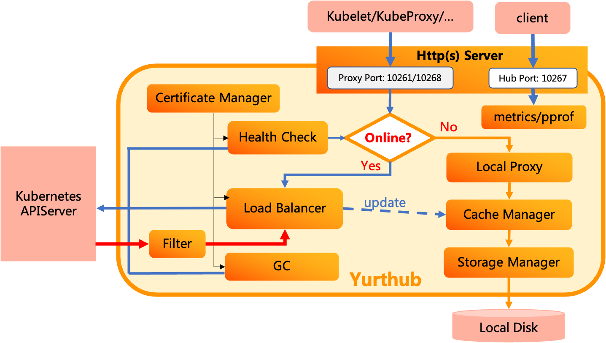

# YurtHub

YurtHub is a node daemon that supports node autonomy in each edge node.
It caches the states of necessary APIServer objects in the local storage when cluster-edge networking is established.
In case an edge node is offline, YurtHub guarantees that all the registered components
in the node can access the cached APIServer object states, pretending the APIServer is still alive.

## Architecture

<div align="left">
  
</div>

\
Here are a few key components in YurtHub:
- **Http Server**: proxying all the http requests sent to the local listeners to the corresponding handler based on the
  network connectivity with the cloud site APIServer.
- **Load Balancer**: sending the requests to one of the cloud site APIServer endpoints. It supports round-robin or
  priority based routing.
- **Cache Manager**: providing interfaces to manage the data saved in the local storage. The data
  are updated based on the https response from the cloud site APIServer, and are read by
  the `Local Proxy` in case node is offline.
- **Certificate Manager**: managing the client certificate for all the components that may access the cloud
  site APIServer. For example, YurtHub may use the certificate generated by Kubelet to communicate with the cloud site APIServer.
- **Health Check**: periodically checking the network connectivity between the cloud site APIServer and the node.
- **Filter**: some filters are provided for mutating the response data from cloud site APIServer, `servicetopology`, `discardcloudservice`,
  `masterservice` filters are present now.

## Deployment

YurtHub is deployed as a Kubelet static Pod ([yaml](../../config/setup/yurthub.yaml)). And YurtHub will be installed automatically by `[yurtadm join](https://openyurt.io/docs/installation/yurtadm-join#1-joining-nodes-from-scratch)` command.

## Data Storage

The cached data are saved in the following node disk location
```
/etc/kubernetes/cache/{component}/{resource}/{namespace}/{name}.json
```

- **component**: obtained from the header of the http request. The key is "User-Agent".
- **resource**: the type of the cached APIServer object such as `pods`, `configmaps`, `services` and so on.
- **namespace**: the namespace of the cached APIServer object, optional. Cluster scoped objects do not have namespace.
- **name**: the name of the cached APIServer object.

## Register Customize Components

Only response for built-in agent names such as kubelet/flanneld/coredns/kube-proxy can be cached on local disk.
In order to leverage the cache capability of Yurthub for customize node components that need to access cloud site APIserver,
please do the following:
1. Add component `User-Agent` in `cache_agents` field of `kube-system/yurthb-cfg` configmap. take `foo` and `bar` component as example:
```
apiVersion: v1
kind: ConfigMap
metadata:
  name: yurt-hub-cfg
  namespace: kube-system
data:
  cache_agents: "foo, bar"
```

2. If you want to enable cache capability for all components, please configure `*` for `cache_agents` field of `kube-system/yurthb-cfg` configmap.
