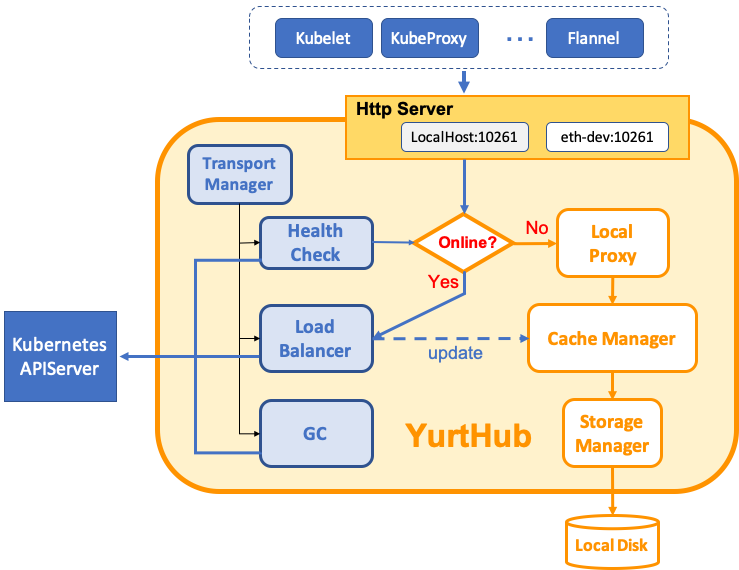

# YurtHub

YurtHub is a node daemon that supports node autonomy in each edge node. 
It caches the states of necessary APIServer objects in the local storage when cluster-edge networking is established.
In case an edge node is offline, YurtHub guarantees that all the registered components 
in the node can access the cached APIServer object states, pretending the APIServer is still alive.

## Architecture

<div align="left">
  
</div>

\
Here are a few key components in YurtHub:
- **Http Server**: proxy all the http requests sent to the local listeners to the corresponding handler based on the
  network connectivity with the cloud site APIServer.
- **Load Balancer**: send the requests to one of the cloud site APIServer endpoints. It supports round-robin or
  priority based routing.
- **Cache Manager**: provide interfaces to manage the data saved in the local storage. The data
  are updated based on the https response from the cloud site APIServer, and are read by
  the `Local Proxy` in case node is offline.
- **Transport Manager**: maintain the valid client certificate for all the components that may access the cloud
  site APIServer.
- **Health Check**: periodically check the network connectivity between the cloud site APIServer and the node.

## Deployment

YurtHub is deployed as a Kubelet static Pod ([yaml](../../config/setup/yurthub.yaml)). We recommend to
use `yurtctl` to install or update Yurthub. See the [tutorial](../../docs/tutorial/yurtctl.md).

## Data Storage

The cached data are saved in the following node disk location
```
/etc/kubernetes/cache/{component}/{namespace}/{name}.json
```

- **component**: obtained from the header of the http request. The key is "User-Agent", required.
- **namespace**: the namespace of the cached APIServer object, optional. Cluster scoped objects do not have namespace.
- **name**: the name of the cached APIServer object, required.

## Register Customize Components

To leverage the autonomy capability of Yurthub for customize node components that need to access cloud site APIserver, 
please do the following:
1. Use the Yurthub listener address. For example, localhost:10261.
2. Add `Edge-Cache: true` to the http request header. 
3. Add `User-Agent: {component-name}` to the http request header. Please avoid using the built-in agent names such as kubelet/flannel/coredns/kube-proxy.
4. Add `Accept: application/json` or `Accept: application/vnd.kubernetes.protobuf` to the http request header based on the required serialization format.
